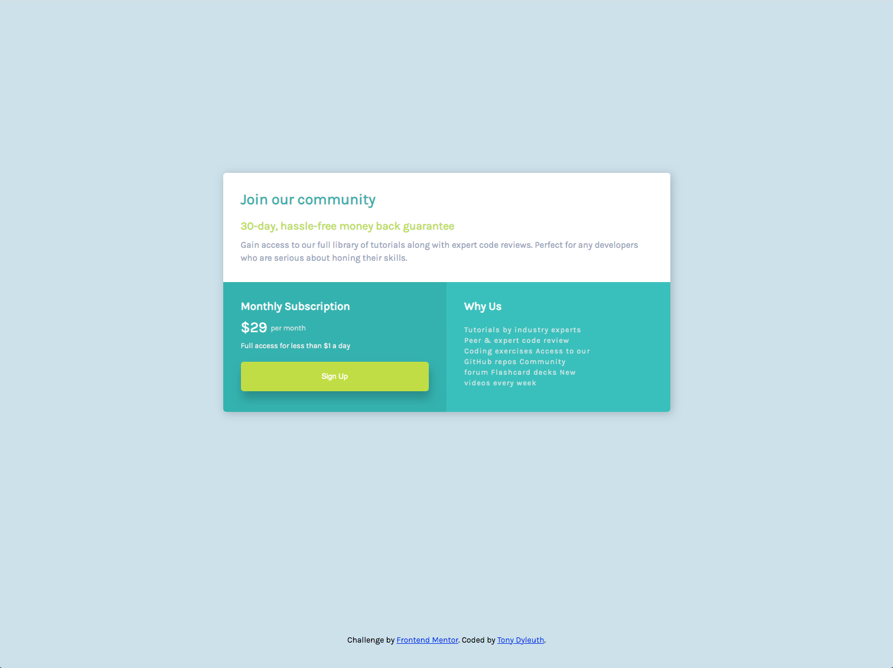

# Frontend Mentor - Single price grid component solution

This is a solution to the [Single price grid component challenge on Frontend Mentor](https://www.frontendmentor.io/challenges/single-price-grid-component-5ce41129d0ff452fec5abbbc). Frontend Mentor challenges help you improve your coding skills by building realistic projects.

## Table of contents

-   [Overview](#overview)
    -   [The challenge](#the-challenge)
    -   [Screenshot](#screenshot)
    -   [Links](#links)
-   [My process](#my-process)
    -   [Built with](#built-with)
    -   [What I learned](#what-i-learned)

## Overview

### The challenge

Users should be able to:

-   View the optimal layout for the component depending on their device's screen size
-   See a hover state on desktop for the Sign Up call-to-action

### Screenshot

### Links

-   Solution URL: [github](https://github.com/tdyleuth/front-end-single-price-grid-component)
    -- Live URL: [github](https://gracious-hypatia-937adc.netlify.app/)

## My process

### Built with

-   Semantic HTML5 markup
-   CSS custom properties
-   Flexbox

### What I learned

I used the design prototypes as a guide when building out the component to simulate a real world project. I learned how to style my grid component using flexbox. I was also able create a mobile responsive design using media queries.
